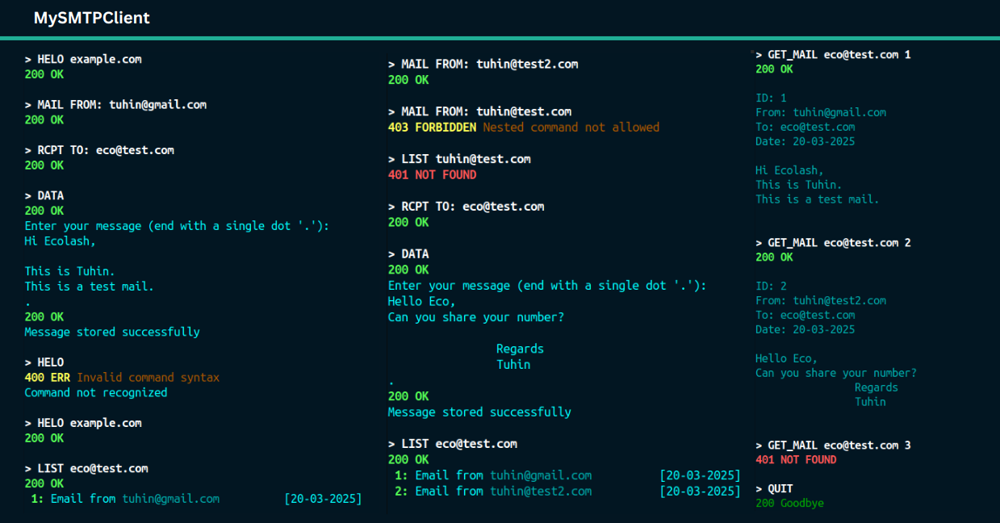

# mySMTP Protocol Implementation

A simple SMTP-like (Simple Mail Transfer Protocol) client-server application for sending and managing emails over a local network. This implementation includes a server that manages mailboxes and a client that can send emails and interact with the server.

## Table of Contents
- [Features](#features)
- [Protocol Specification](#protocol-specification)
  - [Commands](#commands)
  - [Response Codes](#response-codes)
  - [Session Flow](#session-flow)
- [Server Implementation](#server-implementation)
  - [Compilation](#server-compilation)
  - [Usage](#server-usage)
  - [Features](#server-features)
- [Client Implementation](#client-implementation)
  - [Compilation](#client-compilation)
  - [Usage](#client-usage)
- [Directory Structure](#directory-structure)
- [Example Session](#example-session)
- [Error Handling](#error-handling)

## Features

- **Email Sending**: Compose and send emails to specified recipients
- **Mailbox Management**: Store emails in recipient-specific mailboxes
- **Email Listing**: List all emails for a specific recipient
- **Email Retrieval**: Get the content of a specific email by ID
- **Colored Output**: Intuitive color-coded responses for better readability
- **Multi-client Support**: The server handles multiple clients simultaneously

## Protocol Specification

### Commands

The mySMTP protocol supports the following commands:

| Command | Syntax | Description |
|---------|--------|-------------|
| `HELO` | `HELO <client_id>` | Initialize connection with client identification |
| `MAIL FROM` | `MAIL FROM:<email>` | Specify sender's email address |
| `RCPT TO` | `RCPT TO:<email>` | Specify recipient's email address |
| `DATA` | `DATA` | Start message input mode (end with a single `.`) |
| `LIST` | `LIST <email>` | List all emails for the specified recipient |
| `GET_MAIL` | `GET_MAIL <email> <id>` | Retrieve a specific email by ID |
| `QUIT` | `QUIT` | Terminate the session |

### Response Codes

The server responds with the following standardized codes:

| Code | Description |
|------|-------------|
| `200 OK` | Command executed successfully |
| `400 ERR` | Invalid command syntax |
| `401 NOT FOUND` | Requested resource not found |
| `403 FORBIDDEN` | Action not permitted or command out of sequence |
| `500 SERVER ERROR` | Internal server error |

### Session Flow

A typical email sending session follows this sequence:

1. Client connects to server
2. Client initiates with `HELO`
3. Client specifies sender with `MAIL FROM`
4. Client specifies recipient with `RCPT TO`
5. Client initiates message with `DATA`
6. Client enters message content, ending with a single `.`
7. Server confirms message storage
8. Client can send more emails or terminate with `QUIT`

## Server Implementation

### Server Compilation

```bash
gcc mysmtp_server.c -o mysmtp_server
```

### Server Usage

```bash
./mysmtp_server [-port <port_number>]
```

Default port: 2525

### Server Features

- **Concurrent Client Handling**: Uses `fork()` to handle multiple clients simultaneously
- **State Machine Design**: Enforces correct command sequence
- **Mailbox Management**: Creates a mailbox directory and files for each recipient
- **Email Storage**: Stores emails with metadata (ID, sender, recipient, date)
- **Signal Handling**: Properly handles child process termination

## Client Implementation

### Client Compilation

```bash
gcc mysmtp_client.c -o mysmtp_client
```

### Client Usage

```bash
./mysmtp_client [-IP <server_ip>] [-port <port_number>]
```
Default IP: 127.0.0.1  
Default port: 2525

## Example Session



## Error Handling

The protocol implements various error checks:

- **Command Sequence**: Ensures commands are executed in the correct order
- **Syntax Validation**: Validates command syntax 
- **Resource Availability**: Checks if mailboxes exist before operations
- **Connection Handling**: Handles connection errors and timeouts
- **Nested Command Prevention**: Prevents duplicate commands in a single sequence

---

Implementation by: Tuhin Mondal (22CS10087)
